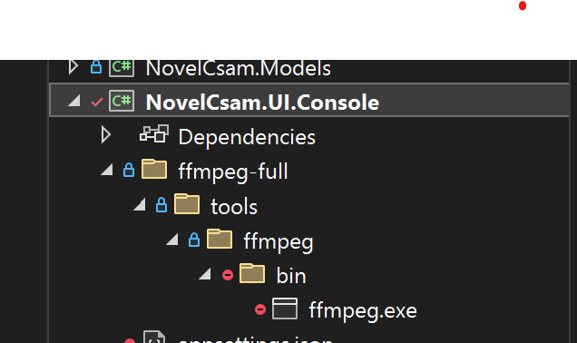

# NovelCsamDetection

## Azure AI Content Safety

- [https://learn.microsoft.com/en-us/azure/ai-services/content-safety/overview]()
- [https://learn.microsoft.com/en-us/azure/ai-services/content-safety/concepts/harm-categories?tabs=warning]()

## Overview

`NovelCsam.UI.Console` is a console application that provides functionality for extracting frames from video files, uploading them to Azure Blob Storage, and running safety analysis on the extracted frames.

## Features

- Extract frames from video files.
- Upload extracted frames to Azure Blob Storage.
- Run safety analysis on the extracted frames.
- Supports multiple image formats.
- Export results.

## Prerequisites

- .NET 8 SDK
  - [Download .NET 8 SDK](https://dotnet.microsoft.com/en-us/download/dotnet/8.0).
- Azure Storage Account
- Azure Content Safety Service
  - [https://learn.microsoft.com/en-us/azure/ai-services/content-safety/overview]()
- FFMpeg
  - The `ffmpeg.exe` file must be placed in the `NovelCsam.UI.Console` project directory, as shown in the picture. You can download the executable for various platforms, including Windows, from the link above.
  - [Download FFmpeg](https://ffmpeg.org/download.html)
  - 

## Getting Started

### Clone the Repository

```sh
git clone https://github.com/yourusername/NovelCsamDetection.git
cd NovelCsamDetection/NovelCsam.UI.Console
```

## Application Configuration

The application requires configuration for Azure Storage, Content Safety services, Azure SQL Database, Azure Cosmos DB, OpenAI Service, and Application Insights. Update the `appsettings.json` file with your Azure credentials and settings.

**If  ***InvokeOpenAI* **is set to True, then please populate:**

* **"OpenAiDeploymentName",**
* **"OpenAiKey",**
* **"OpenAiEndpoint",**
* **"OpenAiModel"**

```
{
  "Azure": {
    "SqlConnectionString": "",
    "ContentSafetyConnectionString": "",
    "ContentSafetyConnectionKey": "",
    "StorageAccountName": "",
    "StorageAccountKey": "",
    "StorageAccountUrl": "",
    "OpenAiDeploymentName": "",
    "OpenAiKey": "",
    "OpenAiEndpoint": "",
    "OpenAiModel": "",
    "AppInsightsConnectionString": "",
    "AnalyzeFrameAzureFunctionUrl": "",
    "InvokeOpenAI": "",
    "DebugToConsole":""
  }
}
```

### Configuration Placeholders

* **Azure SQL Connection String** : `"SqlConnectionString"`
* **Content Safety Connection String** : `"ContentSafetyConnectionString"`
* **Content Safety Connection Key** : `"ContentSafetyConnectionKey"`
* **Storage Account Name** : `"StorageAccountName"`
* **Storage Account Key** : `"StorageAccountKey"`
* **Storage Account URL** : `"StorageAccountUrl"`
* **OpenAI Deployment Name** : `"OpenAiDeploymentName"`
* **OpenAI Key** : `"OpenAiKey"`
* **OpenAI Endpoint** : `"OpenAiEndpoint"`
* **OpenAI Model** : `"OpenAiModel"`
* **App Insights Connection String** : `"AppInsightsConnectionString"`
* **Invoke Open AI**: `"InvokeOpenAI"`
* **Debug to Console**: `"DebugToConsole"`

## Configuration Definitions

* **SqlConnectionString** :
  * **Purpose** : Provides the connection string for connecting to an Azure SQL Database. This string includes the server address, database name, user credentials, and other connection settings.
* **`ContentSafetyConnectionString`** :
  * **Purpose** : Specifies the connection string for the Azure Content Safety service, which is used to access the content safety API.
* **`ContentSafetyConnectionKey`** :
  * **Purpose** : Contains the API key for authenticating with the Azure Content Safety service. This key is required to authorize requests to the content safety API.
* **`StorageAccountName`** :
  * **Purpose** : Specifies the name of the Azure Storage account. This name is used to identify the storage account within Azure.
* **`StorageAccountUrl`** :
  * **Purpose** : Specifies the URL for accessing the Azure Storage account. This URL is used to interact with the storage services provided by the account.
* **`StorageAccountKey`** :
  * **Purpose** : Provides the access key for the Azure Storage account. This key is used to authenticate and authorize access to the storage account.
* **`OpenAiDeploymentName`** :
  * **Purpose** : Indicates the deployment name for the OpenAI service. This name is used to identify the specific deployment of the OpenAI model.
* **`OpenAiKey`** :
  * **Purpose** : Contains the API key for authenticating with the OpenAI service. This key is required to authorize requests to the OpenAI API.
* **`OpenAiEndpoint`** :
  * **Purpose** : Specifies the endpoint URL for accessing the OpenAI service. This URL is used to send requests to the OpenAI API.
* **`OpenAiModel`** :
  * **Purpose** : Indicates the model name for the OpenAI service. This name is used to specify which OpenAI model to use for processing requests.
* **`AppInsightsConnectionString`** :
  * **Purpose** : Provides the connection string for Azure Application Insights. This string is used to configure telemetry data collection and monitoring.
* **`AnalyzeFrameAzureFunctionUrl`** :
  * **Purpose** : Specifies the URL for the Azure Function that analyzes frames. This URL is used to trigger the function and pass data for analysis.
* **`InvokeOpenAI`** :
  * **Purpose** : A flag indicating whether to invoke the OpenAI service. This flag is used to enable or disable calls to the OpenAI API.
    * True or False value.
* **`DebugToConsole`:**
  * **Purpose** : A flag indicating whether to output debug information to the console. This flag is used to enable or disable console logging for debugging purposes.
    * True or False value.

## Code Structure

* `Program.cs`: The main entry point of the application.
* `IVideoHelper.cs`: Interface for video-related operations.
* `IStorageHelper.cs`: Interface for storage-related operations.
* `VideoHelper.cs`: Implementation of video-related operations.
* `StorageHelper.cs`: Implementation of storage-related operations.

## Database

This application uses a SQL database.
The database table create scripts can be found under
the "Infrastructure" folder. This code can also be
changed to use any database that we choose. There is
code that writes result data to a Cosmos DB for example under NovelCsam.Helpers/CosmosDBHelper.cs.

* **Create_Tables.sql :** Database tables

## Contributing

Contributions are welcome! Please open an issue or submit a pull request for any improvements or bug fixes.

## License

This project is licensed under the MIT License. See the LICENSE file for details.

## Contact

For any questions or support, please contact [c](vscode-file://vscode-app/c:/Users/cwoodland/AppData/Local/Programs/Microsoft%20VS%20Code/resources/app/out/vs/code/electron-sandbox/workbench/workbench.html)woodland@microsoft.com.
